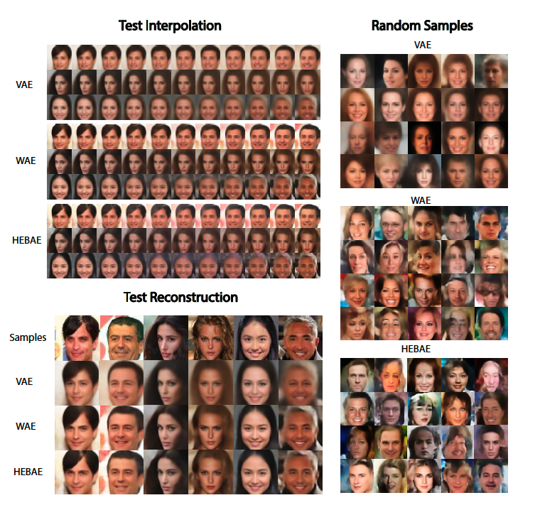

# Hierarchical Empirical Bayes Auto-Encoder (HEBAE)
This is the official implementation for Hierarchical Empirical Bayes Auto-Encoder (HEBAE). It contains the code for training the Hierarchical Empirical Bayes AutoEncoders(HEBAE)/VAE/WAE on CelebA and MNIST datasets.

# Dependencies:
Python >= 3.7.4,
tensorflow >= 2.1.0,
tensorflow-probability >= 0.9.0,
keras >= 2.3.1,
matplotlib >= 3.1.2,
numpy >= 1.17.2,
Pillow >= 7.1.0,
scikit-learn >= 0.21.3,
scipy >= 1.4.1

# Datasets:
MNIST dataset can be downloaded here:http://yann.lecun.com/exdb/mnist/

CelebA dataset can be downloaded here:http://mmlab.ie.cuhk.edu.hk/projects/CelebA.html (For the paper, we center crop and resize images to 64by64 resolution.)

# Notes
The names for code have the following formats:
1. `[datasets]_[model].py` - specify the model architectures
2. `[datasets]_[model]_train.py` - script to train the corresponding model

# For Usage
Please check the `[datasets]_[model]_train.py` script to see the details. For both dataset, all the hyper-parameters including latent dimension size, batch size, number of training epochs and etc can be changed easily. The default numbers are used in the paper. One can also change hidden layer sizes or number of hidden layers easily without any compile errors for MNIST dataset. However for CelebA dataset, one need to manually change the architectures in `CelebA_[model].py` to make the convolutional layers compatible with each other. 

# Example Images

# Other Guidelines:
1. `utils.py` contains helper function to load in data.
2. `CelebA_[model]_generate_img.py` contains the code to generate images using a pre-trained model for the CelebA dataset. The code for generating images for MNIST are commented out in the *`MNIST_[model]_train.py` file. This model can be trained quickly.

# Relevant Citations:
W. Cheng, G. Darnell, S. Ramachandran, L. Crawford (2020). Generalizing Variational Autoencoders with Hierarchical Empirical Bayes. _arXiv_:2007.10389
